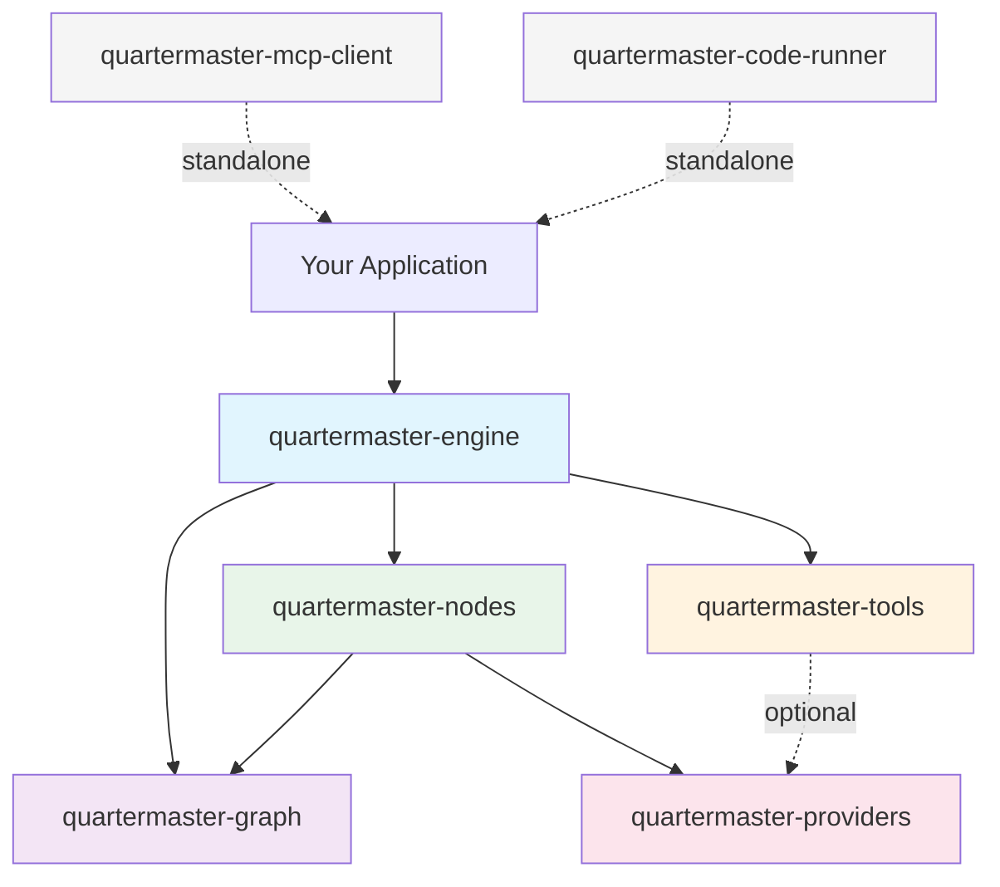
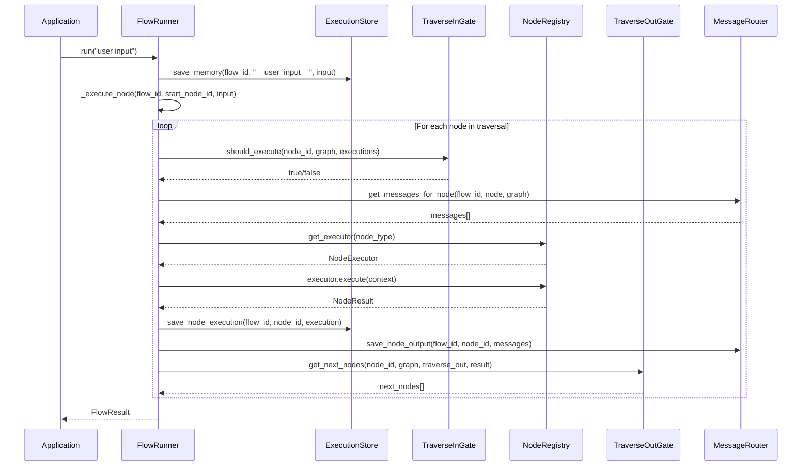

# Architecture Overview

Quartermaster is a modular AI agent orchestration framework composed of seven independent Python packages. Each package has a single responsibility and can be installed standalone or combined into a full execution stack.

## Package Dependency Graph

## Package Responsibilities

| Package | Responsibility | Key Types |
|---------|---------------|-----------|
| **quartermaster-graph** | Graph schema, builder API, validation | `Graph` (`GraphBuilder`), `GraphNode`, `GraphEdge`, `AgentVersion`, `NodeType` |
| **quartermaster-providers** | LLM provider abstraction and registry | `AbstractLLMProvider`, `ProviderRegistry`, `LLMConfig`, `TokenResponse` |
| **quartermaster-tools** | Tool definition, `@tool` decorator, registry, JSON schema export | `AbstractTool`, `tool`, `ToolRegistry`, `ToolDescriptor`, `ToolParameter` |
| **quartermaster-nodes** | Node execution protocols and type contracts | `NodeContext`, `LLMProvider`, `ThoughtHandle`, `ExpressionEvaluator` |
| **quartermaster-engine** | Flow execution, traversal, memory, streaming | `FlowRunner`, `FlowResult`, `ExecutionStore`, `SyncDispatcher` |
| **quartermaster-mcp-client** | MCP protocol client (SSE + Streamable HTTP) | Standalone, no framework dependency |
| **quartermaster-code-runner** | Docker-based sandboxed code execution | Standalone FastAPI service |

## Data Flow

A request flows through the system in the following sequence:

### Step-by-Step Execution

1. **Graph Definition** -- The application builds a graph using `Graph` (alias for `GraphBuilder`) from `quartermaster-graph`. The builder itself IS the graph -- `.nodes` and `.edges` are directly accessible without calling `.build()`.

2. **Runner Initialization** -- A `FlowRunner` is created with the graph, a `NodeRegistry` (maps node types to executors), an `ExecutionStore` (state persistence), and a dispatcher (sync, threaded, or async).

3. **Traversal Start** -- `FlowRunner.run()` locates the start node and begins the execution loop. The user's input is stored in flow memory.

4. **Node Execution** -- For each node:
   - The `TraverseInGate` checks whether all predecessors have completed (for `AwaitAll`) or just one (for `AwaitFirst`).
   - The `MessageRouter` assembles the conversation history from predecessor nodes.
   - The `NodeRegistry` resolves the executor for the node type.
   - The executor runs with an `ExecutionContext` containing messages, memory, and metadata.
   - The result is persisted and output messages are saved.

5. **Successor Dispatch** -- The `TraverseOutGate` determines which successor nodes to trigger based on the node's `traverse_out` strategy (`SpawnAll`, `SpawnPicked`, `SpawnNone`, `SpawnStart`).

6. **Branching and Merging** -- Decision/If/Switch nodes use `SpawnPicked` to route to a single branch (no merge needed -- branches converge directly on the next node). Parallel nodes use `SpawnAll` to fork into concurrent branches. After parallel execution, `StaticMerge` (no LLM) or `Merge` (LLM synthesis) nodes use `AwaitAll` to wait for all branches before continuing.

7. **Completion** -- When all branches reach an End node or stop, `FlowRunner` collects the final output from the End node's execution result and returns a `FlowResult`.

## Design Principles

### Framework-Agnostic

Quartermaster has zero dependencies on web frameworks, task queues, or ORMs. The `quartermaster-nodes` package defines pure Python protocols (`NodeContext`, `LLMProvider`, `ThoughtHandle`) that decouple node logic from any specific runtime. You can integrate Quartermaster with FastAPI, Flask, a CLI tool, or a Jupyter notebook.

### Pluggable Storage

The `ExecutionStore` protocol in `quartermaster-engine` defines the interface for persisting flow state. Built-in implementations include `InMemoryStore` (testing) and `SQLiteStore` (local persistence). Implementing a Redis, PostgreSQL, or DynamoDB store requires only satisfying the protocol.

### Pluggable Providers

The `ProviderRegistry` in `quartermaster-providers` manages LLM connections. Providers are registered by name and lazily instantiated. Model-to-provider inference is automatic: passing `model="gpt-4o"` resolves to the `openai` provider, `model="claude-sonnet-4-20250514"` resolves to `anthropic`, and so on.

### Pluggable Dispatchers

The engine supports three dispatcher strategies:
- **SyncDispatcher** -- Sequential execution in the calling thread. Simple and predictable.
- **ThreadDispatcher** -- Thread pool for parallel branch execution. Ideal for I/O-bound LLM calls.
- **AsyncDispatcher** -- asyncio-based concurrency for async web applications.

### Validated Graphs

The `validate_graph()` function in `quartermaster-graph` checks for structural correctness before execution: exactly one Start node, at least one End node, no orphan nodes, no unintended cycles, and proper edge labeling on Decision/If/Switch nodes.

## Cross-Package Communication

Packages communicate through well-defined types:

- `quartermaster-graph` defines `GraphNode`, `GraphEdge`, `AgentVersion`, and `NodeType` -- these are the shared schema.
- `quartermaster-engine` imports graph types to traverse the structure and engine-specific types (`Message`, `MessageRole`) for internal messaging.
- `quartermaster-nodes` imports `LLMConfig` from `quartermaster-providers` and defines protocols that both `quartermaster-engine` and custom runtimes can satisfy.
- `quartermaster-tools` optionally bridges to `quartermaster-providers` via `ToolDescriptor.to_tool_definition()`, but works standalone for tool registration and JSON schema export.

## Standalone Packages

Two packages operate independently of the core framework:

### quartermaster-mcp-client

A pure-Python client for the Model Context Protocol (MCP). It supports both SSE (Server-Sent Events) and Streamable HTTP transport modes. This package has no dependency on any other Quartermaster package and can be used in any Python project that needs to communicate with MCP servers.

### quartermaster-code-runner

A Docker-based sandboxed code execution service. It runs user-submitted code (Python, Node.js, Go, Rust, Deno, Bun) inside ephemeral containers with configurable memory, CPU, disk, network, and timeout limits. The service exposes a FastAPI HTTP API with optional API key or Bearer token authentication.

## Key Abstractions

### Protocols Over Inheritance

The `quartermaster-nodes` package uses Python `Protocol` classes (structural subtyping) rather than abstract base classes. This means node implementations do not need to import or inherit from any Quartermaster type -- they only need to match the expected method signatures.

Key protocols:
- `NodeContext` -- The context passed to a node during execution, providing metadata, memory, and thought state.
- `LLMProvider` -- Interface for calling LLM services (`generate_stream`, `generate_structured`).
- `ThoughtHandle` -- Interface for appending text and metadata to a thought during execution.
- `ExpressionEvaluator` -- Interface for safely evaluating Python expressions in node conditions.

### Pydantic Models

The `quartermaster-graph` package uses Pydantic v2 models for all graph schema types. This provides automatic JSON serialization, validation, and OpenAPI schema generation. Graph definitions can be serialized to JSON/YAML for storage and loaded back without loss.

### Dataclasses for Lightweight Types

The `quartermaster-providers` and `quartermaster-tools` packages use standard Python dataclasses for configuration and result types (`LLMConfig`, `ToolDescriptor`, `ToolResult`, `TokenResponse`). This avoids the Pydantic dependency in packages where validation overhead is unnecessary.

## See Also

- [Getting Started](getting-started.md) -- Installation and first agent
- [Graph Building](graph-building.md) -- Graph builder API and node types
- [Providers](providers.md) -- LLM provider configuration
- [Tools](tools.md) -- Tool system documentation
- [Engine](engine.md) -- Execution engine details
- [Security](security.md) -- Security considerations
