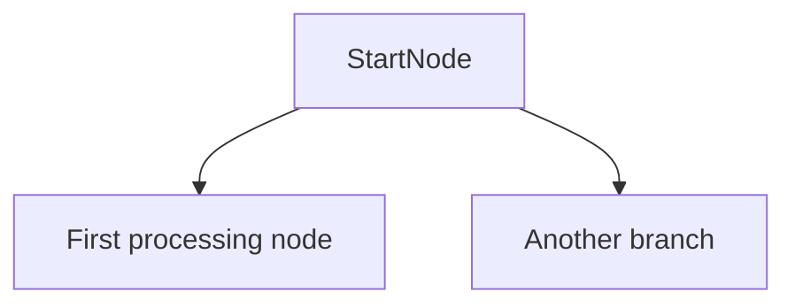
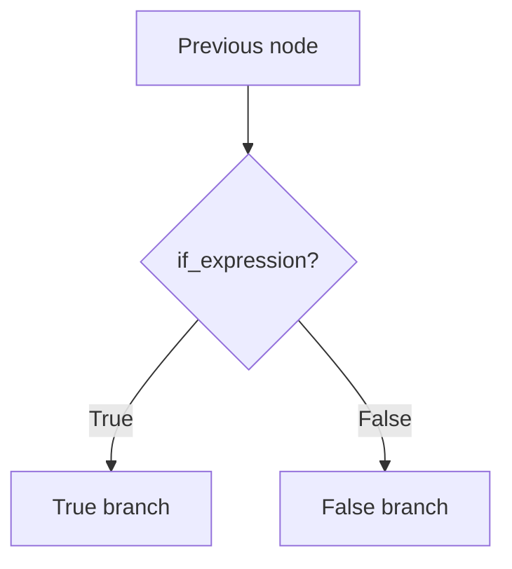
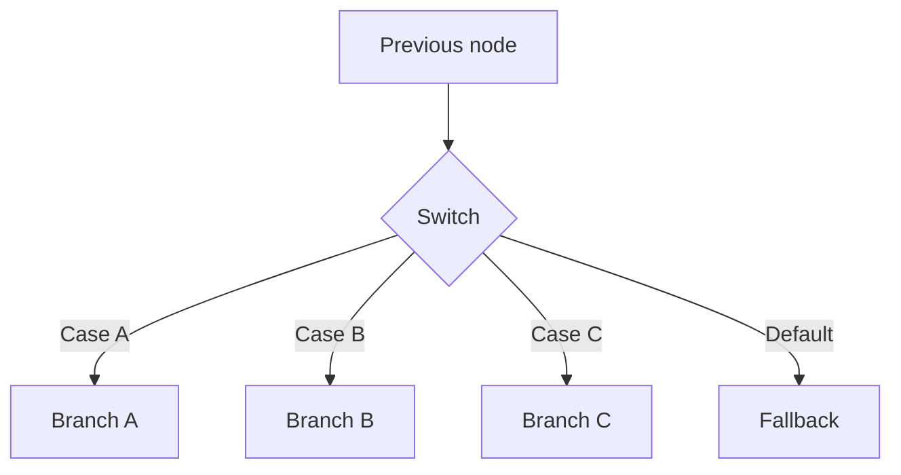
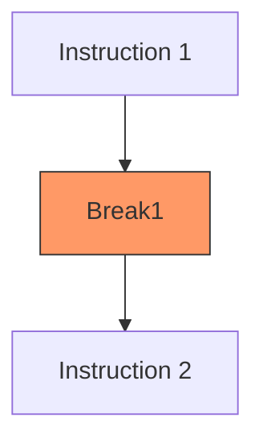
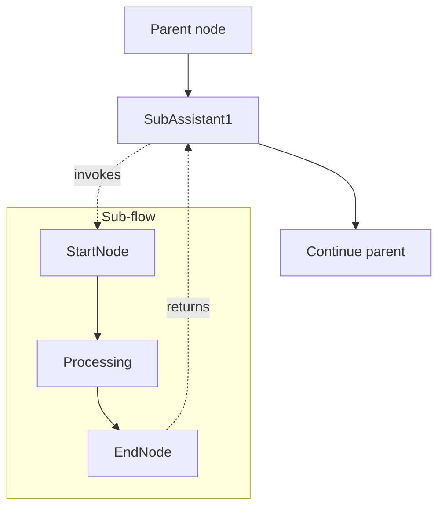
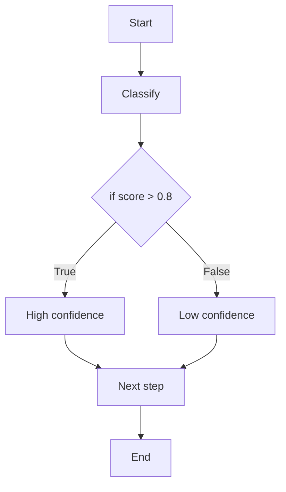
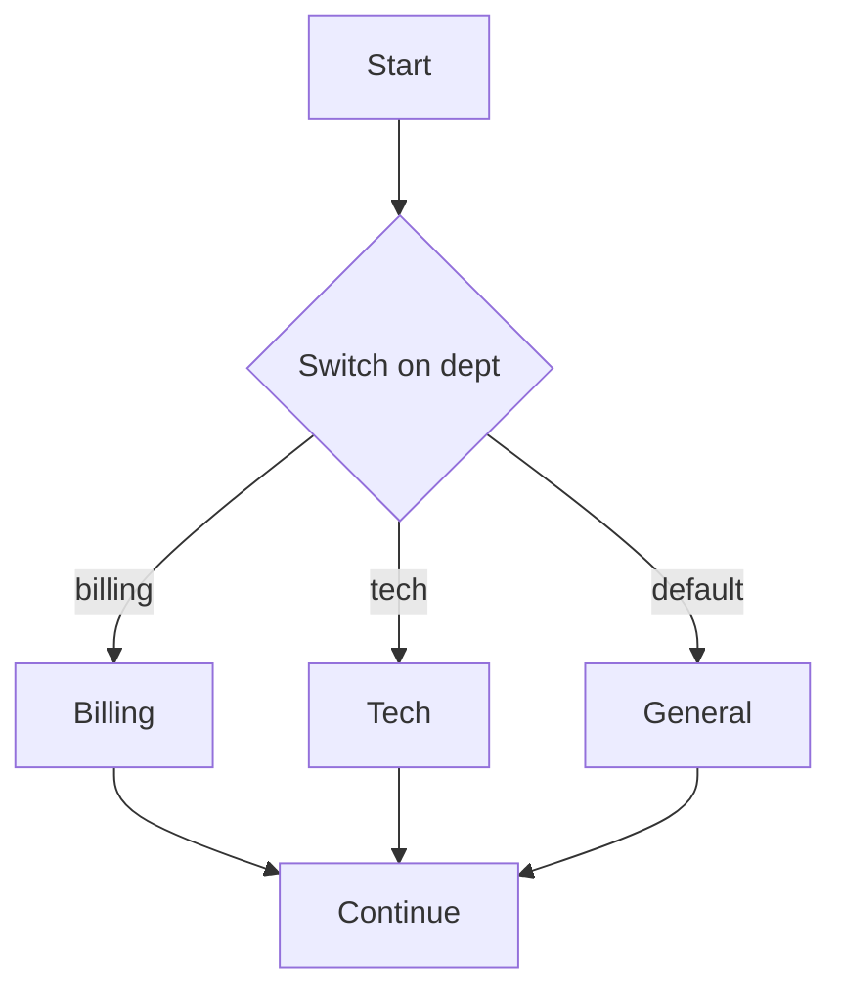
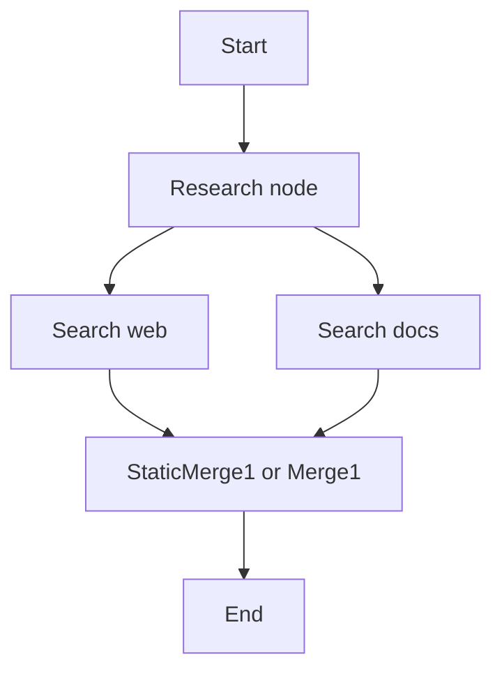

# Control Flow Nodes

Control flow nodes govern how the engine traverses the graph -- where execution
starts, how it branches, where it stops, and how context is scoped. None of
these nodes call an LLM; they inherit directly from `AbstractAssistantNode`.

See the [Node Reference](README.md) for the full node catalogue and traversal
model.

---

## StartNodeV1

**Node name:** `StartNode` | **Version:** 1.0 | **Class:** `StartNodeV1`

The mandatory entry point for every flow. When the engine begins executing a
graph, it starts at this node. The `think()` method delegates to an optional
memory initializer injected via `ctx.node_metadata["_memory_initializer"]`,
which sets up flow-scoped and user-scoped memory stores.

### Configuration

| Field | Key | Type | Default | Description |
|---|---|---|---|---|
| *(none)* | -- | -- | -- | StartNode has no configurable metadata |

### Traversal

* **In:** `AwaitFirst` (only one entry point exists, so this is effectively immediate).
* **Out:** `SpawnAll` -- activates every outgoing edge.
* **Thought type:** `SkipThought1` -- does not create a thought.
* **Edges:** Does **not** accept incoming edges (`accepts_incoming_edges=False`).

### Flow pattern



### Common use cases

* Every flow must begin with exactly one StartNode.
* Initialize flow memory, user memory, or environment variables.

---

## EndNodeV1

**Node name:** `EndNode` | **Version:** 1.0.0 | **Class:** `EndNodeV1`

Terminates the current flow. Its `traverse_out` is set to `SpawnStart`, which
means the engine will look for Start nodes of connected downstream agents and
spawn them. The `think()` method is a no-op -- all behavior is handled by the
traversal configuration.

### Configuration

| Field | Key | Type | Default | Description |
|---|---|---|---|---|
| *(none)* | -- | -- | -- | EndNode has no configurable metadata |

### Traversal

* **In:** `AwaitFirst`
* **Out:** `SpawnStart` -- spawns Start nodes of connected agents.
* **Thought type:** `SkipThought1` -- does not create a thought.
* **Edges:** Does **not** accept outgoing edges (`accepts_outgoing_edges=False`).

### Common use cases

* Terminate a flow and hand off to a connected agent.
* Create clear separation between independent flow segments.

---

## IfNode

**Node name:** `IfNode1` | **Version:** 1.0 | **Class:** `IfNode`

Binary conditional branching. Evaluates a Python expression against the
current thought's metadata and picks the `true` or `false` edge. Each
outgoing edge must be marked with `main_direction=True` or
`main_direction=False` to indicate which branch it represents.

### Configuration

| Field | Key | Type | Default | Description |
|---|---|---|---|---|
| Expression | `if_expression` | `str` | `""` | Python expression evaluated against thought metadata |

The expression is evaluated in a restricted scope: `{"__builtins__": {}}` with
the thought's metadata dict as local variables. If an `_expression_evaluator`
is injected in `ctx.node_metadata`, it is used instead of raw `eval`.

### Traversal

* **In:** `AwaitFirst`
* **Out:** `SpawnPickedNode` -- only the true or false edge fires.
* **Thought type:** `UsePreviousThought1` -- reuses the incoming thought.

### How it works

1. Reads the `if_expression` from metadata.
2. Retrieves the thought's metadata dict.
3. Finds the two outgoing edges (one with `main_direction=True`, one `False`).
4. Evaluates the expression. If truthy, picks the true edge; otherwise false.
5. Writes the chosen edge ID to the handle via `NEXT_ASSISTANT_NODE_ID`.

### Flow pattern



### Example

```python
graph = (
    GraphBuilder("Sentiment Router")
    .start()
    .instruction("Analyze sentiment", model="gpt-4o")
    .if_node("Is positive?", expression="sentiment == 'positive'")
    .on("true").instruction("Positive reply").end()
    .on("false").instruction("Negative reply").end()
    .build()
)
```

### Convergence after IfNode

Because IfNode uses `SpawnPickedNode`, only one branch executes. The branches
can converge directly at a downstream node (using `traverse_in=AwaitFirst`).
Do **not** place a Merge or StaticMerge after an IfNode -- those use
`AwaitAll` and would block forever waiting for the branch that was not taken.

### Common use cases

* Branch on extracted variables (sentiment, intent, score thresholds).
* Guard clauses that skip expensive processing when conditions are not met.

---

## SwitchNode1

**Node name:** `Switch1` | **Version:** 1.0 | **Class:** `SwitchNode1`

Multi-way branching with an ordered list of case expressions. The first case
whose expression evaluates to truthy wins. If no case matches, the default
edge is followed. Raises `ValueError` if neither a case nor a default matches.

### Configuration

| Field | Key | Type | Default | Description |
|---|---|---|---|---|
| Cases | `cases` | `list[dict]` | `[]` | Ordered list of `{"edge_id": str, "expression": str}` |
| Default edge ID | `default_edge_id` | `str\|None` | `None` | Fallback edge when no case matches |

Each case dict must contain:
- `edge_id` -- the ID of the outgoing edge to activate.
- `expression` -- a Python expression evaluated against thought metadata.

### Traversal

* **In:** `AwaitFirst`
* **Out:** `SpawnPickedNode`
* **Thought type:** `UsePreviousThought1`

### How it works

1. Iterates through `cases` in order.
2. Evaluates each expression against the thought's metadata.
3. The first truthy result wins -- that edge ID is stored in `NEXT_ASSISTANT_NODE_ID`.
4. If no case matches, falls back to `default_edge_id`.
5. If no default is configured either, raises `ValueError`.

### Flow pattern



### Example

```python
metadata = {
    "cases": [
        {"edge_id": "edge-billing", "expression": "department == 'billing'"},
        {"edge_id": "edge-tech", "expression": "department == 'tech'"},
        {"edge_id": "edge-sales", "expression": "department == 'sales'"},
    ],
    "default_edge_id": "edge-general",
}
```

### Convergence after SwitchNode

Because SwitchNode uses `SpawnPickedNode`, only the matched branch executes.
Branches converge directly at a downstream node (using
`traverse_in=AwaitFirst`). Do **not** place a Merge or StaticMerge after a
SwitchNode -- those use `AwaitAll` and would block forever.

### Common use cases

* Routing to different specialist flows based on a classification variable.
* Multi-language routing based on a detected locale.

---

## BreakNode1

**Node name:** `Break1` | **Version:** 1.0.0 | **Class:** `BreakNode1`

A message collection boundary. When an LLM node builds its context by walking
backward through the thought tree, it stops at Break nodes. This controls how
much conversation history the LLM sees. The `break_targets` field allows
selective clearing of specific message types rather than a full stop.

### Configuration

| Field | Key | Type | Default | Description |
|---|---|---|---|---|
| Break targets | `break_targets` | `list[str]` | `[]` | What to clear: `[]` = full break, `["tools"]` = clear tool messages, `["thinking"]` = clear thinking messages |

### Traversal

* **In:** `AwaitFirst`
* **Out:** `SpawnAll`
* **Thought type:** `SkipThought1` -- does not create a thought.
* **Message type:** `System` -- acts as a system-level signal.

### How it works

The `think()` method is a no-op. The Break node's effect is entirely during
**message collection** (the `PrepareMessages` chain handler). When the handler
walks backward through the thought tree and encounters a Break node, it either
stops collecting entirely (empty `break_targets`) or removes the specified
message types from the collected context.

### Flow pattern



In this pattern, `Instruction 2` will not see messages from `Instruction 1`
in its context window.

### Common use cases

* Prevent token budget overflow in long multi-step flows.
* Create logical conversation segments (e.g., research phase vs. writing phase).
* Selectively clear tool call/result pairs to reduce noise.

---

## SubAssistant1

**Node name:** `SubAssistant1` | **Version:** 1.0 | **Class:** `SubAssistant1`

Invokes another assistant flow as a nested sub-routine. The engine runs the
sub-flow to completion and then returns control to the parent flow. The
sub-flow runner is injected via `ctx.node_metadata["_sub_flow_runner"]`.

### Configuration

| Field | Key | Type | Default | Description |
|---|---|---|---|---|
| Sub-assistant ID | `sub_assistant_id` | `str\|None` | `None` | ID of the assistant flow to invoke |

### Traversal

* **In:** `AwaitFirst`
* **Out:** `SpawnAll`
* **Thought type:** `NewThought1` -- creates a new thought for the sub-flow result.

### How it works

1. Reads `sub_assistant_id` from metadata.
2. If both the ID and a `_sub_flow_runner` callback are present, invokes the
   sub-flow with the current context.
3. The sub-flow executes its own Start -> ... -> End sequence.
4. When the sub-flow completes, the parent flow continues from the SubAssistant
   node's outgoing edges.

### Flow pattern



### Example

```python
GraphBuilder("Orchestrator") \
    .start() \
    .instruction("Decide task", model="gpt-4o") \
    .sub_agent("Run specialist", graph_id="specialist-flow-id") \
    .instruction("Summarize result", model="gpt-4o") \
    .end() \
    .build()
```

### Common use cases

* Reusing a tested sub-flow across multiple parent flows.
* Modularizing complex agents into smaller, independently testable components.

---

## Traversal comparison

| Node | traverse_in | traverse_out | Creates thought? |
|---|---|---|---|
| StartNodeV1 | AwaitFirst | SpawnAll | No (SkipThought) |
| EndNodeV1 | AwaitFirst | SpawnStart | No (SkipThought) |
| IfNode | AwaitFirst | SpawnPickedNode | No (UsePrevious) |
| SwitchNode1 | AwaitFirst | SpawnPickedNode | No (UsePrevious) |
| BreakNode1 | AwaitFirst | SpawnAll | No (SkipThought) |
| SubAssistant1 | AwaitFirst | SpawnAll | Yes (NewThought) |

## Branching patterns

### Binary branch (IfNode) -- no merge needed

IfNode uses `SpawnPickedNode`, so only **one** branch executes. The branches
converge directly at a downstream node without any merge step. A Merge or
StaticMerge node would never fire here because only one incoming edge will
ever arrive.



The `Next step` node receives exactly one incoming activation (whichever
branch was picked). It should use `traverse_in=AwaitFirst`. Do **not** place
a Merge or StaticMerge here -- those nodes use `AwaitAll` and would hang
waiting for the branch that never fires.

### Multi-way branch (SwitchNode) -- no merge needed

SwitchNode also uses `SpawnPickedNode`. The same rule applies: branches
converge directly and no merge is required.



### Parallel branches (SpawnAll) -- merge required

When a node uses `SpawnAll` (e.g., StartNode, InstructionNode), **all**
outgoing edges fire simultaneously. To collect those parallel results back
into a single path, use one of:

| Node | When to use |
|---|---|
| `StaticMerge1` | You only need to join the branch outputs into one context. No LLM call -- just concatenates the thoughts. |
| `Merge1` | You need an LLM to synthesize or compress the parallel outputs into a single coherent message. |


