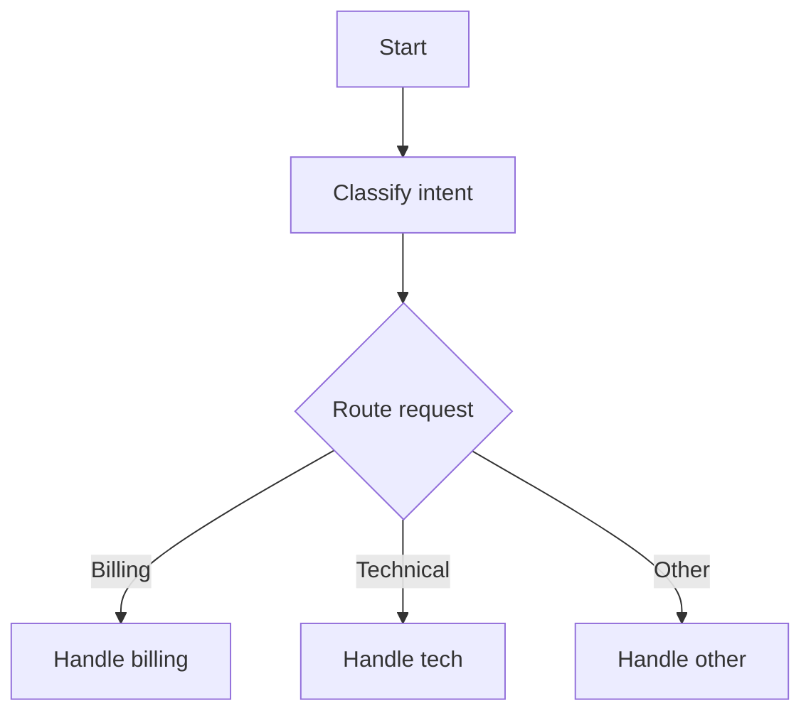
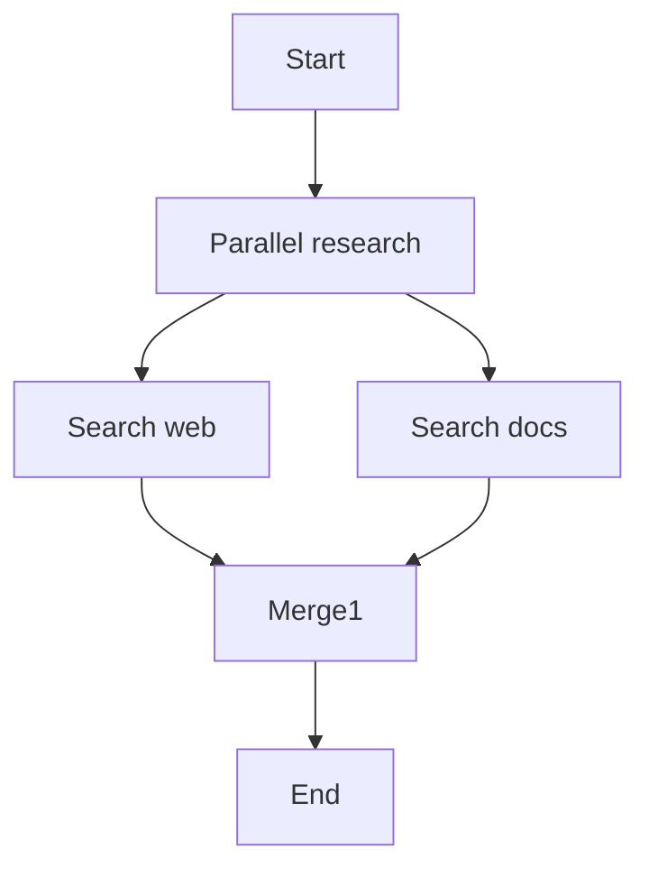
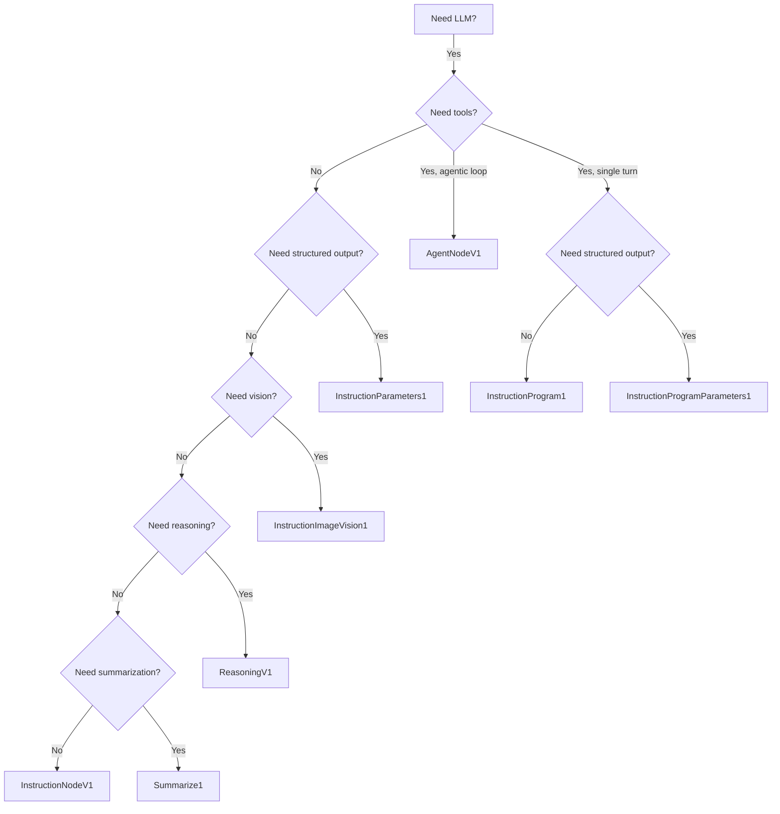

# LLM Nodes

LLM nodes call a language model to generate text, make decisions, or extract
structured data. They all inherit from `AbstractLLMAssistantNode` and share a
common set of configuration fields for model selection, token limits, and
streaming. Each node composes a `Chain` of handlers to prepare messages,
manage context, call the provider, and process the response.

See the [Node Reference](README.md) for how nodes, chains, and traversal work.

---

## InstructionNodeV1

**Node name:** `InstructionNode` | **Version:** 1.0 | **Class:** `InstructionNodeV1`

The core LLM node. Sends a system instruction plus conversation history to a
language model and streams the response back. Use this whenever you need a
single-turn LLM generation.

### Configuration

| Field | Key | Type | Default | Description |
|---|---|---|---|---|
| System instruction | `llm_system_instruction` | `str` | `"You are helpful agent..."` | System prompt prepended to every request |
| Model | `llm_model` | `str` | `"gpt-4o-mini"` | Model identifier |
| Provider | `llm_provider` | `str` | `"openai"` | Provider name |
| Temperature | `llm_temperature` | `float` | `0.5` | Sampling temperature |
| Max input tokens | `llm_max_input_tokens` | `int` | `16385` | Context window budget |
| Max output tokens | `llm_max_output_tokens` | `int` | `2048` | Max tokens to generate |
| Max messages | `llm_max_messages` | `int\|None` | `None` | Cap on conversation messages sent |
| Stream | `llm_stream` | `bool` | `True` | Whether to stream the response |
| Thinking level | `llm_thinking_level` | `str` | `"off"` | Extended thinking: off/low/medium/high |

### Traversal

* **In:** `AwaitFirst` -- fires on the first incoming edge.
* **Out:** `SpawnAll` -- activates every outgoing edge.
* **Thought type:** `NewThought1` (creates a new thought).

### Chain

`ValidateMemoryID` -> `PrepareMessages` -> `ContextManager` -> `TransformToProvider` -> `GenerateStreamResponse` -> `ProcessStreamResponse`

### Example

```python
GraphBuilder("Bot") \
    .start() \
    .instruction("Summarize input", model="gpt-4o",
                 system_instruction="Summarize the user's message.") \
    .end() \
    .build()
```

### Common use cases

* Single-turn text generation with a system prompt.
* Follow-up responses in a multi-node conversation flow.

---

## AgentNodeV1

**Node name:** `AgentNode` | **Version:** 1.0 | **Class:** `AgentNodeV1`

An autonomous agent that runs an iterative loop. On each iteration the LLM
either generates text (ending the loop) or calls tools. Tool results are fed
back and the loop continues until the task is complete or the iteration limit
is reached.

### Configuration

All fields from InstructionNodeV1 plus:

| Field | Key | Type | Default | Description |
|---|---|---|---|---|
| Program version IDs | `program_version_ids` | `list` | `[]` | Tool IDs available to the agent |
| Max iterations | `max_iterations` | `int` | `25` | Iteration cap for the agentic loop |
| Tool clearing trigger | `context_tool_clearing_trigger` | `int` | `10000` | Token threshold to start clearing tool messages |
| Tool clearing keep | `context_tool_clearing_keep` | `int` | `3` | Number of recent tool exchanges to keep |
| Max tool result tokens | `context_max_tool_result_tokens` | `int` | `2000` | Truncation limit per tool result |

### Traversal

* **In:** `AwaitFirst` | **Out:** `SpawnAll`
* **Error handling:** `Retry` (with Stop and Continue available).

### Chain (per iteration)

`ValidateMemoryID` -> `PrepareMessages` -> `ContextManager` -> `TransformToProvider` -> `GenerateNativeResponse` -> `ProcessStreamResponse`

The loop exits when the LLM produces no tool calls or the iteration cap is hit.

### Example

```python
GraphBuilder("Research Agent") \
    .start() \
    .node(NodeType.AGENT, "Researcher", metadata={
        "llm_model": "gpt-4o",
        "llm_system_instruction": "You are a research assistant.",
        "program_version_ids": ["web-search-v1"],
        "max_iterations": 10,
    }) \
    .end() \
    .build()
```

### Common use cases

* Multi-step tool use (web search, database queries, API calls).
* Tasks where the LLM decides when it has enough information to stop.

---

## Decision1

**Node name:** `Decision1` | **Version:** 1.0.0 | **Class:** `Decision1`

Uses an LLM to pick which outgoing edge to follow. The LLM is given a
prefix message listing available paths and must call the `pick_path` tool
with the chosen edge ID.

### Configuration

| Field | Key | Type | Default | Description |
|---|---|---|---|---|
| System instruction | `llm_system_instruction` | `str` | `"...decide which path..."` | System prompt for path selection |
| Model | `llm_model` | `str` | `"gpt-4o-mini"` | Model identifier |
| Provider | `llm_provider` | `str` | `"openai"` | Provider name |
| Temperature | `llm_temperature` | `float` | `0.5` | Sampling temperature |
| Max input tokens | `llm_max_input_tokens` | `int` | `32768` | Context window budget |
| Max output tokens | `llm_max_output_tokens` | `int` | `2048` | Max tokens to generate |
| Max messages | `llm_max_messages` | `int\|None` | `None` | Cap on messages |
| Prefix message | `prefix_message` | `str` | `"Based on previous messages..."` | Text before the edge list |
| Suffix message | `suffix_message` | `str` | `""` | Text after the edge list |
| Stream | `llm_stream` | `bool` | `False` | Streaming (disabled by default) |

### Traversal

* **In:** `AwaitFirst` | **Out:** `SpawnPickedNode` -- only the chosen edge fires.
* **Thought type:** `UsePreviousThought1` (reuses the incoming thought).

### Chain

`ValidateMemoryID` -> `PrepareMessages` (with decision message) -> `ContextManager` -> `TransformToProvider` -> `GenerateToolCall` (pick_path) -> `ProcessStreamResponse`

### Example

```python
graph = (
    GraphBuilder("Triage Bot")
    .start()
    .instruction("Classify intent", model="gpt-4o")
    .decision("Route request", options=["Billing", "Technical", "Other"])
    .on("Billing").instruction("Handle billing").end()
    .on("Technical").instruction("Handle tech").end()
    .on("Other").instruction("Handle other").end()
    .build()
)
```



### Common use cases

* Intent routing in multi-skill assistants.
* Dynamic flow selection based on conversation context.

---

## Merge1

**Node name:** `Merge1` | **Version:** 1.0.0 | **Class:** `Merge1`

Waits for all incoming branches, collects their text, and uses an LLM to
merge the results into a single coherent response. Typically placed after
parallel branches created by a Decision or SpawnAll node.

### Configuration

| Field | Key | Type | Default | Description |
|---|---|---|---|---|
| Prefix message | `prefix_message` | `str` | `"Compress following conversations into one"` | Text before merged content |
| Suffix message | `suffix_message` | `str` | `""` | Text after merged content |
| System instruction | `llm_system_instruction` | `str` | `"...combine given messages..."` | System prompt for merging |
| Model | `llm_model` | `str` | `"gpt-4o-mini"` | Model identifier |
| Provider | `llm_provider` | `str` | `"openai"` | Provider name |
| Temperature | `llm_temperature` | `float` | `0.5` | Sampling temperature |
| Max input/output tokens | `llm_max_input_tokens` / `llm_max_output_tokens` | `int` | `16385` / `2048` | Token limits |
| Max messages | `llm_max_messages` | `int\|None` | `None` | Message cap |
| Stream | `llm_stream` | `bool` | `True` | Stream the response |

### Traversal

* **In:** `AwaitAll` -- waits for every incoming edge before executing.
* **Out:** `SpawnAll`

### Chain

`PrepareMessages` (with merged content as assistant message) -> `ContextManager` -> `TransformToProvider` -> `GenerateStreamResponse` -> `ProcessStreamResponse`

### Example



### Common use cases

* Combining results from parallel research branches.
* Producing a unified summary from multiple specialist sub-flows.

---

## ReasoningV1

**Node name:** `ReasoningNode` | **Version:** 1.0 | **Class:** `ReasoningV1`

Specialized for reasoning models (o1-mini, o1). No system instruction is sent.
Defaults: model `o1-mini`, temperature `None`, max input tokens `32768`, max
output tokens `None`. Traversal: `AwaitFirst` / `SpawnAll`.
Use for complex multi-step reasoning, math, or code analysis.

---

## Summarize1

**Node name:** `Summarize1` | **Version:** 1.0 | **Class:** `Summarize1`

Condenses conversation history into a summary. Same fields as InstructionNodeV1
with default instruction `"Summarize the given conversation concisely."`.
Traversal: `AwaitFirst` / `SpawnAll`. Use to reduce context length or store
conversation summaries in memory.

---

## InstructionParameters1

**Node name:** `InstructionParameters1` | **Version:** 1.0 | **Class:** `InstructionParameters1`

Extracts structured data from the LLM by forcing it to call a tool whose
parameters match your desired output schema. Streaming is disabled by default.

### Configuration

All standard LLM fields plus:

| Field | Key | Type | Default | Description |
|---|---|---|---|---|
| Parameters | `parameters` | `list[dict]` | `[]` | Parameter schema: `[{"name", "type", "description", "required"}]` |
| Function name | `function_name` | `str` | `"extract_parameters"` | Name of the generated tool |
| Function description | `function_description` | `str` | `"Extract structured parameters"` | Tool description |
| Stream | `llm_stream` | `bool` | `False` | Disabled for tool calling |

### Traversal

* **In:** `AwaitFirst` | **Out:** `SpawnAll`

### Chain

`ValidateMemoryID` -> `PrepareMessages` -> `ContextManager` -> `TransformToProvider` -> `GenerateToolCall` -> `ProcessStreamResponse`

### Example

```python
metadata = {
    "llm_model": "gpt-4o",
    "llm_system_instruction": "Extract the user's name and email.",
    "parameters": [
        {"name": "user_name", "type": "string", "description": "Full name", "required": True},
        {"name": "email", "type": "string", "description": "Email address", "required": True},
    ],
    "function_name": "extract_contact",
}
```

### Common use cases

* Extracting entities (names, dates, amounts) from free text.
* Populating structured forms from natural language input.

---

## InstructionProgram1

**Node name:** `InstructionProgram1` | **Version:** 1.0 | **Class:** `InstructionProgram1`

Like InstructionNodeV1 but with tools attached. The LLM can call tools during
generation. Extra field: `program_version_ids` (list, default `[]`).
Traversal: `AwaitFirst` / `SpawnAll`. Uses `GenerateStreamResponse`.

---

## InstructionProgramParameters1

**Node name:** `InstructionProgramParameters1` | **Version:** 1.0 | **Class:** `InstructionProgramParameters1`

Combines tool execution with structured parameter extraction. Extra field:
`program_version_ids` (list, default `[]`). Streaming disabled by default.
Traversal: `AwaitFirst` / `SpawnAll`. Uses `GenerateToolCall`.

---

## InstructionImageVision1

**Node name:** `InstructionImageVision1` | **Version:** 1.0 | **Class:** `InstructionImageVision1`

Identical to InstructionNodeV1 with vision enabled (`llm_vision = True`).
Processes images alongside text using a vision-capable model. Use cases:
image captioning, visual QA, document/screenshot analysis.
Traversal: `AwaitFirst` / `SpawnAll`.

---

## LLM node decision tree

Use this diagram to pick the right LLM node for your use case:


