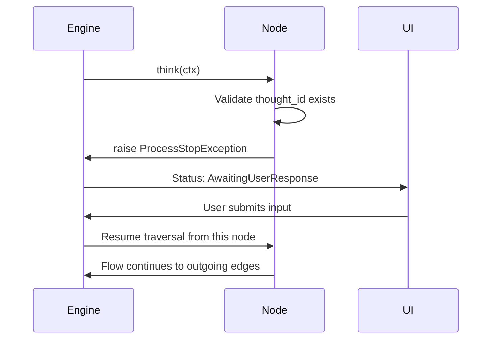
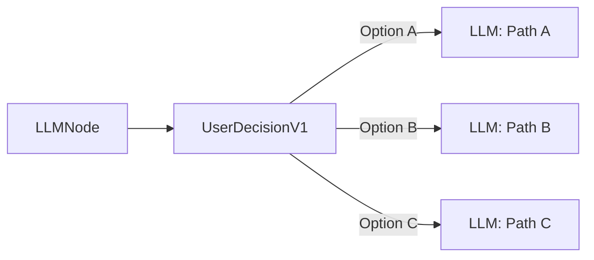

# User Interaction Nodes

User interaction nodes pause flow execution and wait for external input before
continuing. Every node in this category raises a `ProcessStopException` inside
its `think()` method, which the engine catches to suspend the flow. The flow
resumes only after the runtime receives user-supplied data and re-invokes
traversal from the paused node.

See also: [Utility Nodes](utility-nodes.md) | [Graph Building](../graph-building.md)

---

## How the Pause/Resume Cycle Works

All four user interaction nodes share the same lifecycle:



1. The engine calls `think(ctx)` on the node.
2. The node verifies that `ctx.thought_id` is set (raises `MissingMemoryIDException`
   otherwise).
3. The node optionally notifies a status updater callback with `"AwaitingUserResponse"`.
4. The node raises `ProcessStopException`, halting the engine.
5. An external system (UI, API, webhook) submits the user's response.
6. The engine resumes traversal from the paused node's outgoing edges.

---

## UserNode1

| Property | Value |
|---|---|
| **Class** | `UserNode1` |
| **Type enum** | `UserAssistant1` |
| **Version** | `1.0.0` |
| **Module** | `quartermaster_nodes.nodes.user_interaction.user` |

### Description

Pauses flow execution and waits for free-form user input. This is the most
general-purpose interaction node -- it collects an open-ended text message from
the user and stores it as a new thought in the conversation memory.

### Configuration

| Field | Key | Default | Description |
|---|---|---|---|
| Text snippets | `text_snippets` | `[]` | Pre-defined text snippets shown to the user as quick-reply options. |

### Flow Configuration

| Setting | Value |
|---|---|
| Traverse in | `AwaitFirst` -- activates as soon as one incoming edge fires |
| Traverse out | `SpawnAll` -- continues to all outgoing edges after input |
| Thought type | `NewThought1` -- creates a new thought for the user message |
| Message type | `User` |

### Example Graph

```
StartNode --> LLMNode --> UserNode1 --> LLMNode --> EndNode
```

The LLM generates a question, the flow pauses at `UserNode1`, the user replies,
and the second LLM node processes the response.

### UI Integration

Listen for the `AwaitingUserResponse` status, render a text input, and post the
message back to the engine API to resume traversal.

---

## UserDecisionV1

| Property | Value |
|---|---|
| **Class** | `UserDecisionV1` |
| **Type enum** | `UserDecision1` |
| **Version** | `1.0.0` |
| **Module** | `quartermaster_nodes.nodes.user_interaction.user_decision` |

### Description

Presents a set of choices to the user and waits for them to pick one. Unlike
other user nodes that spawn all outgoing edges, this node uses
`SpawnPickedNode` -- only the edge corresponding to the user's selection is
activated, making it the primary branching mechanism driven by human choice.

### Configuration

This node has no custom metadata fields. The choices are derived from the
outgoing edges defined in the graph structure itself. Each outgoing edge
represents one option the user can select.

### Flow Configuration

| Setting | Value |
|---|---|
| Traverse in | `AwaitAll` -- waits for every incoming edge before presenting choices |
| Traverse out | `SpawnPickedNode` -- activates only the edge the user selects |
| Thought type | `UsePreviousThought1` -- reuses the existing thought |
| Message type | `Variable` |

### Example Graph



Each outgoing edge is labeled in the UI. The user picks one, and only that
branch executes.

### Convergence after UserDecisionV1

Because UserDecisionV1 uses `SpawnPickedNode`, only the selected branch
executes. Branches converge directly at a downstream node (using
`traverse_in=AwaitFirst`). Do **not** place a Merge or StaticMerge after
this node -- those use `AwaitAll` and would block forever waiting for the
branches the user did not pick.

### UI Integration

Render outgoing edges as buttons or a radio list. Submit the selected edge
identifier to the engine, which spawns only the chosen branch.

---

## UserFormV1

| Property | Value |
|---|---|
| **Class** | `UserFormV1` |
| **Type enum** | `UserForm1` |
| **Version** | `1.0.0` |
| **Module** | `quartermaster_nodes.nodes.user_interaction.user_form` |

### Description

Collects structured input from the user through a form with defined parameter
fields. Unlike `UserNode1` which accepts free-form text, this node presents
a set of named fields for the user to fill in, making it ideal for gathering
multiple typed inputs at once.

### Configuration

| Field | Key | Default | Description |
|---|---|---|---|
| Parameters | `parameters` | `[]` | List of parameter definitions that make up the form. Each entry describes a field name, type, and validation constraints. |

### Flow Configuration

| Setting | Value |
|---|---|
| Traverse in | `AwaitFirst` |
| Traverse out | `SpawnAll` |
| Thought type | `NewThought1` |
| Message type | `User` |

### Example Graph

```
StartNode --> UserFormV1 --> ToolNode --> EndNode
```

The form collects parameters (e.g., target URL, scan depth, output format),
then the tool node uses those values.

### UI Integration

Read `parameters` metadata to build a dynamic form. Submit the filled values as
a structured object back to the engine.

---

## UserProgramFormV1

| Property | Value |
|---|---|
| **Class** | `UserProgramFormV1` |
| **Type enum** | `UserProgramForm1` |
| **Version** | `1.0.0` |
| **Module** | `quartermaster_nodes.nodes.user_interaction.user_program_form` |

### Description

Lets the user select a tool (program) from a predefined list and configure its
parameters before execution. This combines tool selection with parameter input
in a single interaction step, streamlining flows where the user decides which
tool to run and how to configure it.

### Configuration

| Field | Key | Default | Description |
|---|---|---|---|
| Program version IDs | `program_version_ids` | `[]` | List of tool/program version identifiers that the user can choose from. |

### Flow Configuration

| Setting | Value |
|---|---|
| Traverse in | `AwaitFirst` |
| Traverse out | `SpawnAll` |
| Thought type | `NewThought1` |
| Message type | `User` |

### Example Graph

```
StartNode --> UserProgramFormV1 --> ToolExecutionNode --> EndNode
```

The user picks which tool to run from the available options, fills in its
parameters, and the flow proceeds to execute the selected tool.

### UI Integration

Render a tool selector from `program_version_ids`, then show the parameter form
for the chosen tool. Submit both the tool ID and parameter values to the engine.

---

## Comparison

| Node | Input style | Traverse out | Use when... |
|---|---|---|---|
| `UserNode1` | Free-form text | SpawnAll | You need an open-ended user message |
| `UserDecisionV1` | Pick one option | SpawnPickedNode | The user must choose a branch |
| `UserFormV1` | Structured form | SpawnAll | You need multiple named fields |
| `UserProgramFormV1` | Tool + params | SpawnAll | The user selects and configures a tool |

---

## Resuming a Paused Flow

After the engine catches `ProcessStopException`, the flow status becomes
`AwaitingUserResponse`. To resume, submit user input through the engine's
resume endpoint with the flow execution ID, the paused node's `flow_node_id`,
and the input payload. For `UserDecisionV1`, the payload must include which
outgoing edge was selected so the engine spawns only that branch.
