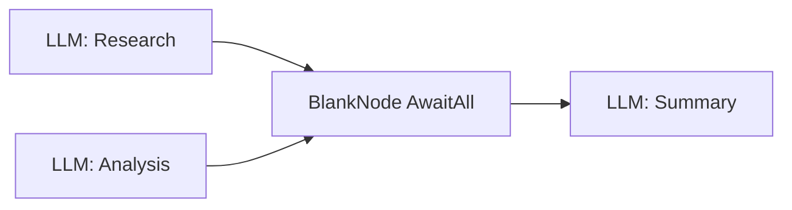

# Utility Nodes

Utility nodes handle housekeeping tasks in the graph: placeholders, comments,
environment management, file loading, and debugging. None of them invoke LLMs
or external tools. Most use `SkipThought1` to pass through without creating a
new thought entry.

See also: [User Interaction Nodes](user-interaction-nodes.md) | [Graph Building](../graph-building.md)

---

## BlankNode

| Property | Value |
|---|---|
| **Class** | `BlankNode` |
| **Type enum** | `Blank1` |
| **Version** | `1.0.0` |
| **Module** | `quartermaster_nodes.nodes.utility.blank` |

### Description

A no-op node that passes through without performing any work. Use it to simplify
graph wiring, merge parallel branches, or reserve a position for future logic.

### Configuration

No custom metadata fields.

### Flow Configuration

| Setting | Value |
|---|---|
| Traverse in | `AwaitFirst` (also supports `AwaitAll`) |
| Traverse out | `SpawnAll` |
| Thought type | `SkipThought1` |
| Message type | `Variable` |

### When to Use

- **Merge point**: Set traverse-in to `AwaitAll` so it waits for every
  incoming edge before continuing. Useful for joining parallel branches.
- **Placeholder**: Reserve a slot in the graph during design, replace later.
- **Readability**: Break long chains into logical segments.

---

## CommentNode

| Property | Value |
|---|---|
| **Class** | `CommentNode` |
| **Type enum** | `Comment1` |
| **Version** | `1.0.0` |
| **Module** | `quartermaster_nodes.nodes.utility.comment` |

### Description

A documentation-only node that annotates the graph. It accepts no incoming or
outgoing edges and is never reached during execution. Use it to explain nearby
nodes or document design decisions directly in the graph.

### Configuration

| Field | Key | Default | Description |
|---|---|---|---|
| Comment | `comment` | `""` | Free-text comment displayed in the graph editor. |

### Flow Configuration

| Setting | Value |
|---|---|
| Traverse in | `AwaitFirst` |
| Traverse out | `SpawnAll` |
| Thought type | `SkipThought1` |
| Message type | `Variable` |
| Accepts incoming edges | **No** |
| Accepts outgoing edges | **No** |

### Documenting Graph Design

Place CommentNodes visually near the graph section they describe. Because they
accept no edges, they never interfere with execution. Use them to explain retry
logic, document design decisions, or leave notes for other graph authors.

---

## UseEnvironmentNode

| Property | Value |
|---|---|
| **Class** | `UseEnvironmentNode` |
| **Type enum** | `UseEnvironment1` |
| **Version** | `1.0.0` |
| **Module** | `quartermaster_nodes.nodes.utility.use_environment` |

### Description

Activates a specific execution environment for subsequent nodes. An environment
defines connection credentials, sandbox boundaries, or runtime settings. The
node delegates to an `_environment_activator` callback from the runtime.

### Configuration

| Field | Key | Default | Description |
|---|---|---|---|
| Environment ID | `environment_id` | `null` | Identifier of the environment to activate. |

### Flow Configuration

| Setting | Value |
|---|---|
| Traverse in | `AwaitFirst` |
| Traverse out | `SpawnAll` |
| Thought type | `SkipThought1` |
| Message type | `Variable` |

### When to Use

Place before any tool or LLM node that needs a specific runtime environment.
---

## UnselectEnvironmentNode

| Property | Value |
|---|---|
| **Class** | `UnselectEnvironmentNode` |
| **Type enum** | `UnselectEnvironment1` |
| **Version** | `1.0.0` |
| **Module** | `quartermaster_nodes.nodes.utility.unselect_environment` |

### Description

Deactivates the currently active execution environment, cleaning up resources.
Delegates to an `_environment_deactivator` callback from the runtime.

### Configuration

No custom metadata fields.

### Flow Configuration

| Setting | Value |
|---|---|
| Traverse in | `AwaitFirst` |
| Traverse out | `SpawnAll` |
| Thought type | `SkipThought1` |
| Message type | `Variable` |

### Environment Activation/Deactivation Pattern

Use `UseEnvironmentNode` and `UnselectEnvironmentNode` as a pair to scope
environment access to a specific section of the graph:

Nodes between the pair execute within the environment. Nodes after deactivation
run in the default context, and environment resources are released promptly.

---

## UseFileNode

| Property | Value |
|---|---|
| **Class** | `UseFileNode` |
| **Type enum** | `UseFile1` |
| **Version** | `1.0.0` |
| **Module** | `quartermaster_nodes.nodes.utility.use_file` |

### Description

Loads a file into the execution context so downstream nodes can access its
content. Delegates to a `_file_loader` callback from the runtime.

### Configuration

| Field | Key | Default | Description |
|---|---|---|---|
| File ID | `file_id` | `null` | Identifier of the file to load into context. |

### Flow Configuration

| Setting | Value |
|---|---|
| Traverse in | `AwaitFirst` |
| Traverse out | `SpawnAll` |
| Thought type | `SkipThought1` |
| Message type | `Variable` |

### When to Use

Place before an LLM node that needs to read a document, or before a tool node
that operates on a file.

---

## ViewMetadataNode

| Property | Value |
|---|---|
| **Class** | `ViewMetadataNode` |
| **Type enum** | `ViewMetadata1` |
| **Version** | `1.0.0` |
| **Module** | `quartermaster_nodes.nodes.utility.view_metadata` |

### Description

A debugging node that serializes the current thought's metadata to JSON and
appends it to the conversation. Insert temporarily during development to verify
variable values. Remove before production use.

### Configuration

No custom metadata fields.

### Flow Configuration

| Setting | Value |
|---|---|
| Traverse in | `AwaitFirst` |
| Traverse out | `SpawnAll` |
| Thought type | `NewThought1` -- creates a visible thought for the output |
| Message type | `Automatic` |

---

## Quick Reference

| Node | Type enum | Purpose |
|---|---|---|
| `BlankNode` | `Blank1` | Placeholder / merge point |
| `CommentNode` | `Comment1` | Graph documentation (no edges) |
| `UseEnvironmentNode` | `UseEnvironment1` | Activate runtime environment |
| `UnselectEnvironmentNode` | `UnselectEnvironment1` | Deactivate runtime environment |
| `UseFileNode` | `UseFile1` | Load file into context |
| `ViewMetadataNode` | `ViewMetadata1` | Debug metadata inspection |
